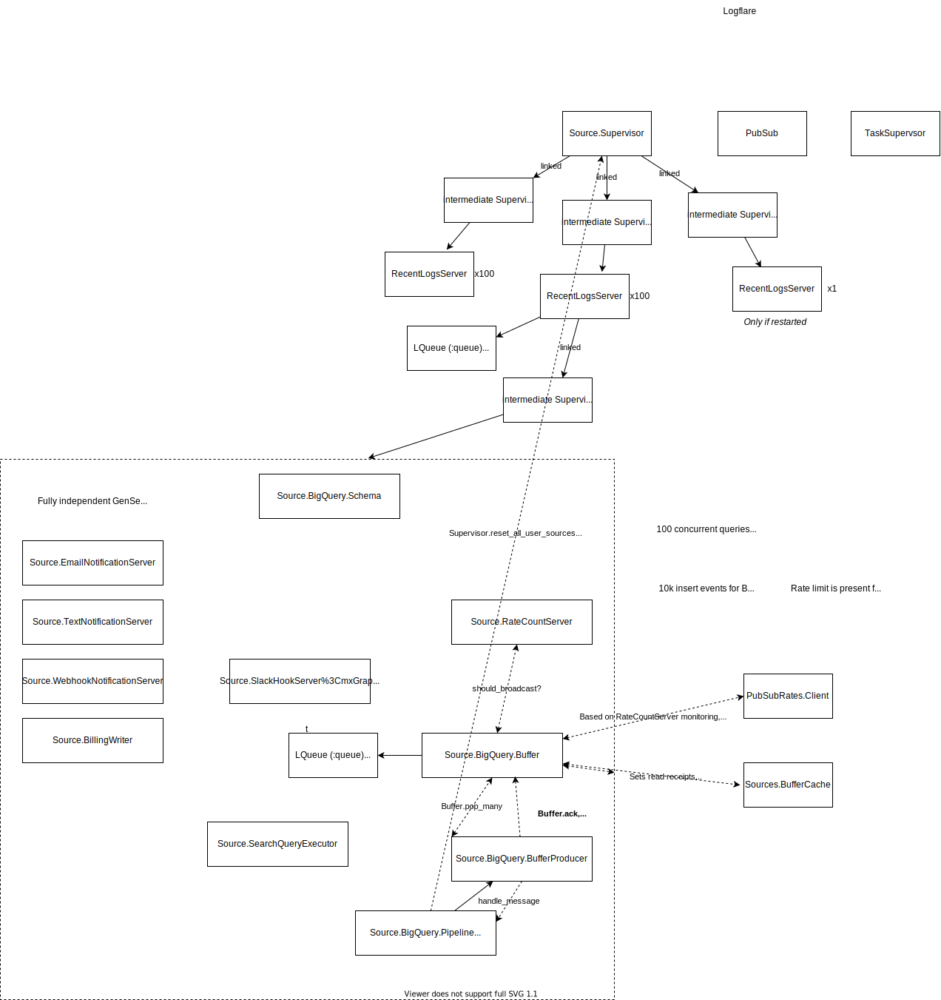

# Architecture

## Log Ingestion

Log ingestion is on a per-source basis. Each source may have multiple backends, and each backend implements its own pipeline for ingesting the events.

## The `SourceSup`

The `SourceSup` is started on a per-source basis, one per node. It provides all functionality required to interact with a specific source.

Log events are added to the MemoryBuffer. From there, events are pulled from the MemoryBuffer and into the Broadway pipeline. These log events are then processed and then dispatched in batches to all backend.