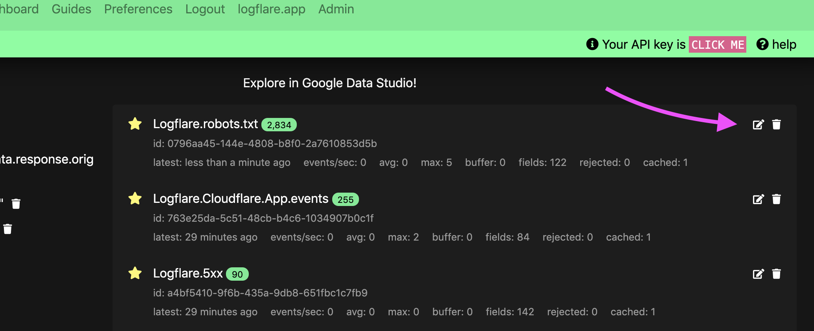
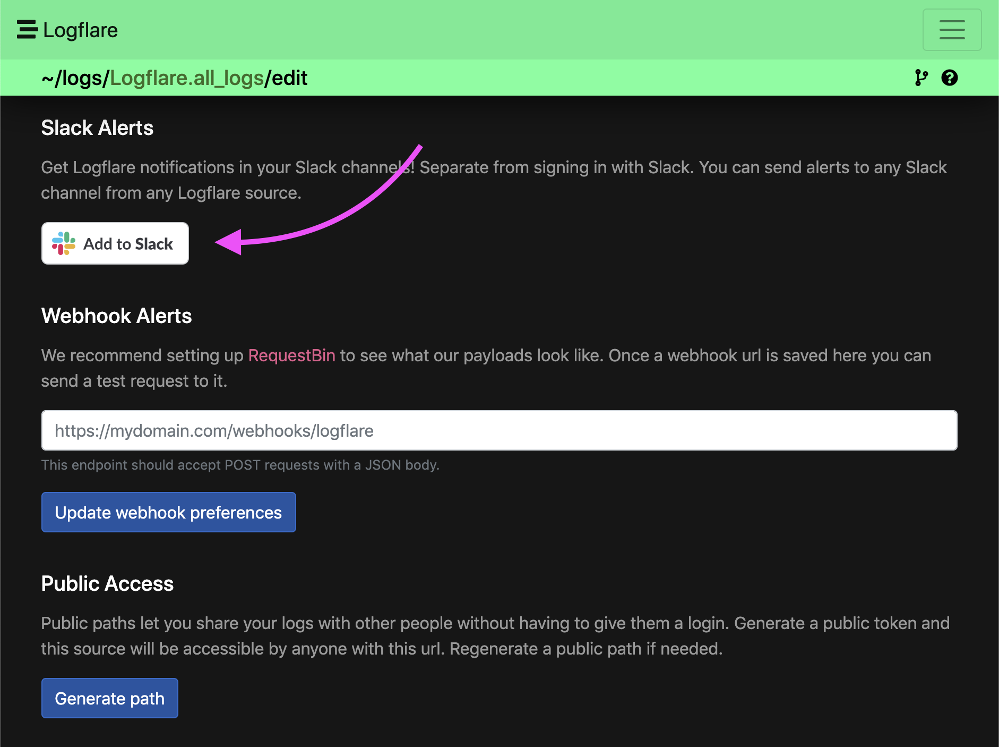
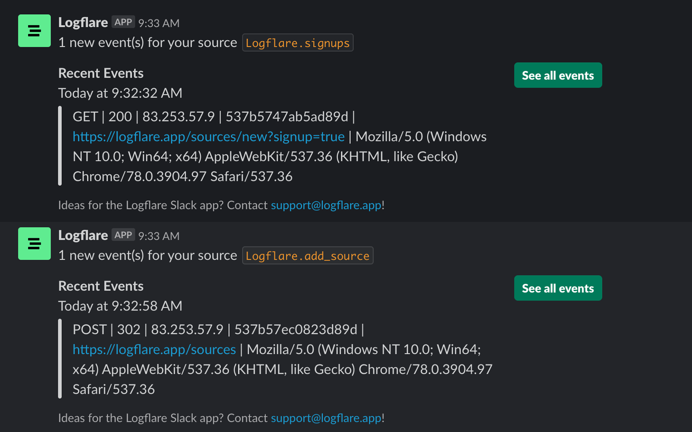

# Setup the Logflare Slack App

Logflare's Slack integration allows you to get log event alerts in your Slack channels.

## Add to Slack

Slack channels are tied to Logflare sources. When you edit a Logflare source you can see options for alerts. Simply click the Add to Slack button and follow the prompts.

## Get Alerts

Once you have your Logflare source connected to a Slack channel you will get alerts about events in that source when they come in.

