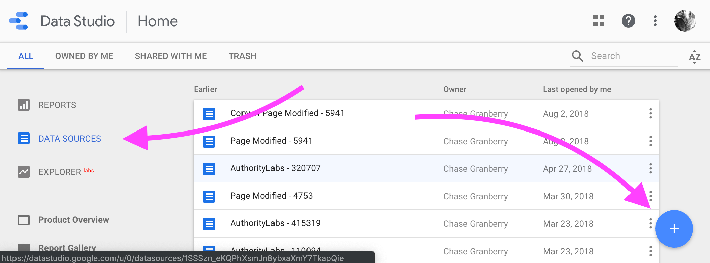
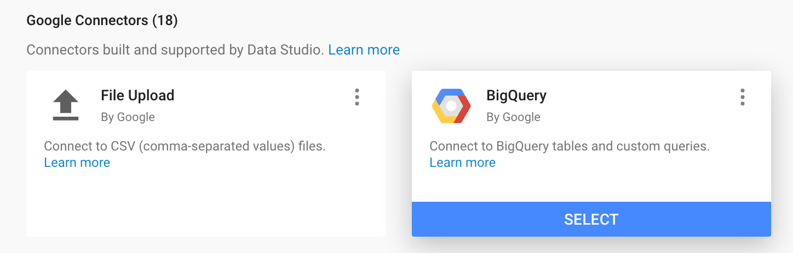
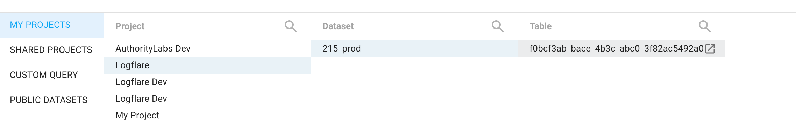
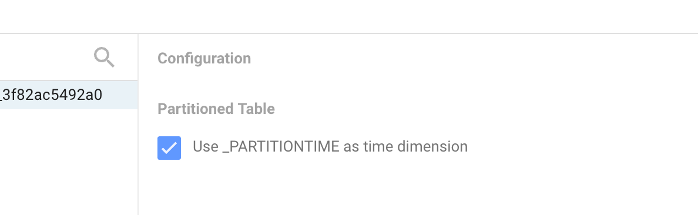
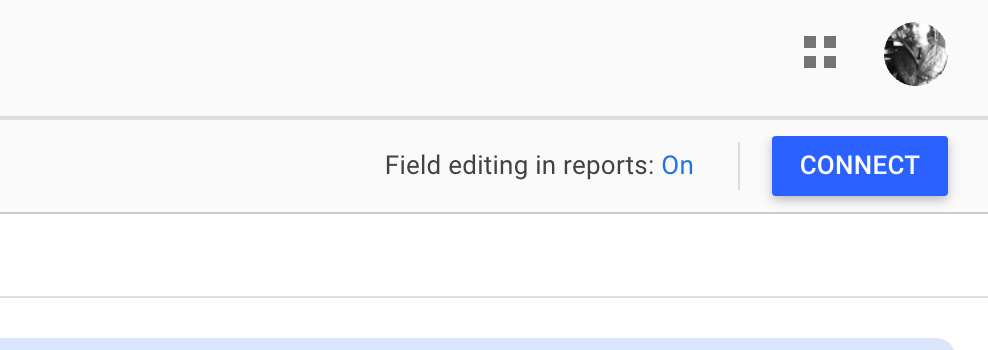
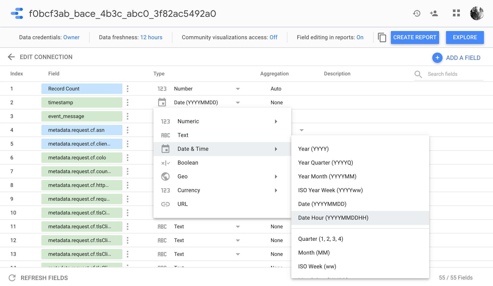
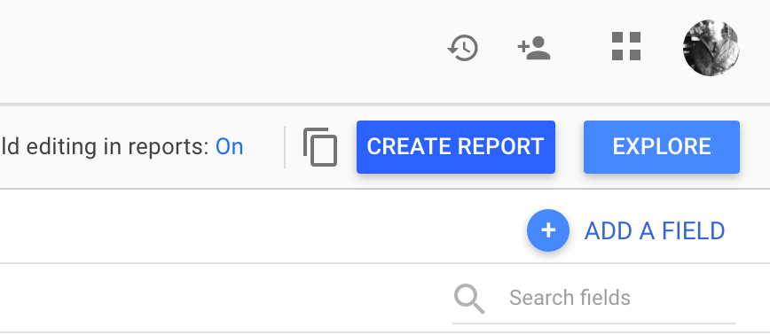
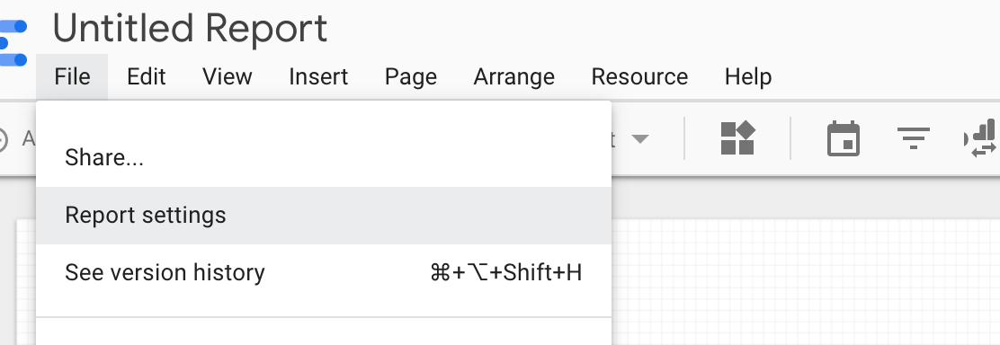
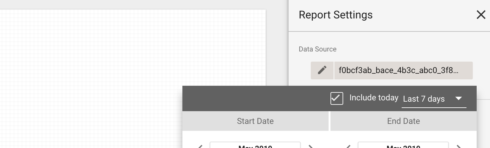
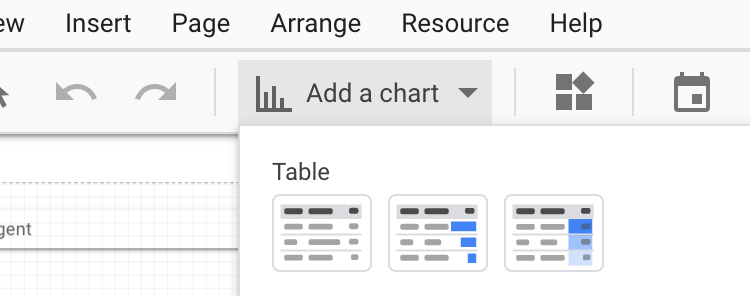

# BigQuery

Logflare natively supports the storage of log events to BigQuery. Ingested logs are **streamed** into BigQuery, and each source is mapped to a BigQuery table.

## Behavior and Configuration

On table initialization, Logflare sets optimal configuration automatically to ensure that tables are optimized.

### Ingestion

Ingested events are [streamed](https://cloud.google.com/bigquery/docs/streaming-data-into-bigquery) into BigQuery. This allows us to maximize the throughput into BigQuery, allowing Logflare to handle large volumes of events.

:::note
Due to this streaming requirement, BYOB GCP projects **must have billing enabled**.
:::

### Partitioning and Retention

All tables are partitioned by the **timestamp** field, and are partitioned by **day**. This means that all queries across the BigQuery table must have a filter over the timestamp field.

Backend Time-To-Live (TTL) is the source setting which configures a BigQuery table's partition expiry. This setting can be configured through Source > Edit > Backend TTL.

For metered plan users, if the TTL is not set, the BigQuery table will default to **7 days**.

For users on the Free plan, the maximum retention is **3 days**.

### Querying

Querying is done using [optional job creation mode](https://cloud.google.com/bigquery/docs/running-queries#optional-job-creation).

:::note
When monitoring or running analysis, the `job_id` of the BigQuery JOBS view will have the `queryId` of the query request made. See [the official documentation](https://cloud.google.com/bigquery/docs/information-schema-jobs#optional-job-creation) for more information.
:::

#### Deep Dive: Table Partitioning

Table partitioning effectively splits a BigQuery table into many smaller tables.
When using partitioned tables, BigQuery storage is effectively half priced when the partitioned table is older than 90 days. When a table has not been modified in 90 days, BigQuery will only charge half the normal rate.

When partitioned over time (which Logflare manages automatically), we are able to benefit from the discount by separating out the older and less-queried smaller tables, reducing total effective storage costs.

Furthermore, by partitioning a table, we can then limit queries to scan data across only selected partitioned column/tables, saving you more money and making your queries even more responsive.

However, the caveat of this is that BigQuery's streaming buffer is not include in partitioned queries by default. This would affect queries across the partitioned tables and would result in a lag time before the data will become visible in the partitioned tables.

Should you need to query against the streaming buffer directly, you can use the following query ([source](https://stackoverflow.com/questions/41864257/how-to-query-for-data-in-streaming-buffer-only-in-bigquery)) to do so:

```sql
SELECT fields FROM `dataset.partitioned_table_name` WHERE _PARTITIONTIME IS NULL
```

You can read more about partitioned tables in the official Google Cloud [documentation](https://cloud.google.com/bigquery/docs/partitioned-tables).

## Logflare-Managed BigQuery

Logflare free and metered users will not need to manage BigQuery settings and permissions, and will have access to their data via their registered e-mail address.

The differences in BigQuery behavior for the two plans are as follows:

| Aspect                  | Free             | Metered       | BYOB      |
| ----------------------- | ---------------- | ------------- | --------- |
| Schema Fields           | Up to 50         | Up to 500     | Up to 500 |
| Retention (Backend TTL) | Up to 3 Days     | Up to 90 days | Unlimited |
| Events                  | 12,960,000/month | Unlimited     | Unlimited |

## Bring Your Own Backend (BYOB)

You can also Bring Your Own Backend by allowing Logflare to manage your GCP project's BigQuery.

This allows you to retain data beyond the metered plan's 90 days, as well as integrating the BigQuery tables managed by Logflare into your BigQuery-backend data warehouse.

Furthermore, you will have complete control over storage and querying costs as you will be billed directly by Google Cloud, while Logflare will only handle the ingestion pipeline.

### Setting Up Your Own BigQuery Backend

:::warning Enable Billing for Project
Enable a Google Cloud Platform billing account with payment information or [we won't be able to insert into your BigQuery table!](#ingestion-bigquery-streaming-insert-error)
:::

#### Step 1: Navigate to IAM and Add a Member

Navigate to `Google Cloud Platform > IAM & admin > IAM`


Then, click on the **Add** button.


#### Step 2: Add the Logflare Service Account

The Logflare service account is:

```
logflare@logflare-232118.iam.gserviceaccount.com
```

Assign `BigQuery Data Owner` and `BigQuery Job User` permissions to the Logflare service account.


:::note
If using [managed service accounts](#managed-service-accounts), include the following additional roles:

- `roles/resourcemanager.projectIamAdmin`
- `roles/iam.serviceAccountCreator`
- `roles/iam.serviceAccountTokenCreator`

:::

#### Step 3: Update Account Settings in Logflare

Find the GCP project ID in the [dashboard](https://console.cloud.google.com/home/dashboard)


Navigate to the [account preferences](https://logflare.app/account/edit) and add in the GCP project ID.


#### Step 4 (Optional): Update Source Settings in Logflare

You can also optionally update your sources' TTL to tweak how long you want to retain log events in BigQuery.


:::note
The steps for setting up self-hosted Logflare requires different BigQuery configurations, please refer to the [self-hosting](/self-hosting) documentation for more details.
:::

### Managed Service Accounts

When query volume for your instance is high, you may experience BigQuery rate limiting for their REST API. This occurs when BigQuery receives over 100 requests per second per user. This adversely affects the Logflare Endpoints functionality as well as Logflare Search functionality.

By default, all BYOB users have managed service accounts disabled. In order to enable routing requests through mangaged service accounts, go to **Accounts > BigQuery Backend > Managed Service Accounts** and enable the setting by ticking the checkbox.

Ensure that the Logflare service account has the following roles:

- `roles/bigquery.admin` **(no change)**
- `roles/resourcemanager.projectIamAdmin` **(new)** - used to set the IAM policy with the managed service accounts
- `roles/iam.serviceAccountCreator` **(new)** - used to create new managed service accounts
- `roles/iam.serviceAccountTokenCreator` **(new)** - used to generate short-lived tokens for authenticating with BigQuery REST API

Enabling this option will have the following effects:

- BigQuery REST API requests made will be routed through multiple managed service accounts. Each managed service account has the `logflare-managed-` prefix followed by the index (for example `logflare-managed-0`).
- IAM policy for this project will be completely managed by Logflare, and permissions for managed service accounts will be handled in a non-destructive manner.

### BigQuery Reservations

For high-volume workloads, you can configure BigQuery reservations to ensure predictable performance and cost control for your queries. Logflare supports separate reservation configurations for search queries and alert queries.

Reservations requires the Logflare service account to be granted the `bigquery.reservations.use` on the reservation or its administration project.

:::note
Reservations are optional. If not configured, queries will run without any reservation set and will use the project's default reservation
:::

## Querying in BigQuery

You can directly execute SQL queries in BigQuery instead of through the Logflare UI. This would be helpful for generating reports that require aggregations, or to perform queries across multiple BigQuery tables.

When referencing Logflare-managed BigQuery tables, you will need to reference the table by the source's UUID. If you are crafting the query within [Logflare Endpoints](/concepts/endpoints), the table name resolution is handled automatically for you.

### Unnesting Repeated Records

Nested columns are represeted as repeated `RECORD`s in BigQuery. To query inside a nested record you must UNNEST it like so:

```sql
SELECT timestamp, req.url, h.cf_cache_status
FROM `your_project_id.your_dataset_name.your_table_name` t
CROSS JOIN UNNEST(t.metadata) m
CROSS JOIN UNNEST(m.request) req
CROSS JOIN UNNEST(m.response) resp
CROSS JOIN UNNEST(resp.headers) h
WHERE DATE(timestamp) = "2019-05-09"
ORDER BY timestamp DESC
LIMIT 10
```

## Troubleshooting

### Ingestion: BigQuery Streaming Insert Error

Logflare uses BigQuery's [streaming insert API](https://cloud.google.com/bigquery/docs/streaming-data-into-bigquery) to provide ingestion functionality.

If you are on the BYOB plan and have configured Logflare to ingest into BigQuery using the above steps, you may receive this error:

```
Access Denied: BigQuery BigQuery: Streaming insert is not allowed in the free tier
```

To resolve this error, you will need enable billing for your project through the GCP console.

## Data Studio (Looker) Integration

When you log into the Logflare service with your Google account, we will automatically provide you access to the underlying Big Query tables associated with all your sources. This allows you to create visualizations and reports in Data Studio.

Looker Studio has extensive documentation and tutorials to help you [learn more](https://support.google.com/looker-studio/#topic=6267740).

### Setup Steps

#### Step 1: Open Data Studio and Add a Data Source



#### Step 2: Select the BigQuery Connector



#### Step 3: Find your Logflare Source

The BigQuery table name will match the ID of the source as per the dashboard.



#### Step 4: Select Partitioned Table Time Dimension

Selecting this option will make your reports faster and let you effectively use the date range picker in a report.
It will also help with ongoing BigQuery costs associated with queries.

It may take up to 15 minutes for ingested data to flow into Data Studio immediately after report creation.



#### Step 5: Connect to the Data



#### Step 6: Set Timestamp Type to Date Hour (Optional)

This allows you to see more fine grained fluctuations in your data.

You can also mix hourly and daily data in your reports using `duplicate` on a field and configuring it to either `Date Hour` or `Date`.



#### Step 7: Create the Report and Configure Settings

Click on "Create Report" to finialize your initial report.


You can also configure the report further by navigating to Report Settings



You should also configure the default data source date range to optimize your query cost.



#### Step 8: Create Your First Charts


