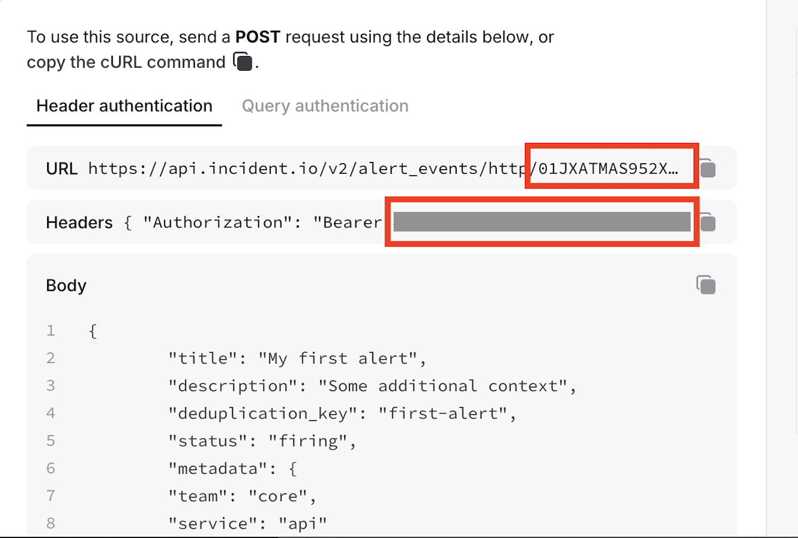

# Incident.io

The Incident.io backend is **alert-only**, and sends alert events to the Incident.io HTTP API.

See the Incident.io API [documentation](https://docs.incident.io/reference/alert-events-http-create-http-alert-event) for details on how the API handles alert events.

## Behaviour and Configuration

### Configuration

The following values are required when creating an Incident.io backend:

- `api_token`: (`string`, required) the API token for authenticating with Incident.io.
- `alert_source_config_id`: (`string`, required) the alert source configuration ID from your Incident.io setup.
- `metadata`: (`object`, optional) additional metadata to be included with alert events. These must be passed in as key-value pairs when adding the backend via the UI. When adding programmatically, it accepts a JSON object.

Find the token and alert source configuration ID in the Incident.io UI:



### Firing events via Logflare Alerts

When using Logflare Alerts, the backend will fire an alert event for each alert query that triggers. The Logflare Alert will perform the query run periodically at the set interval, and if there is any rows returned from the given query, the incident.io event will fire.

The incident.io POST request will receive the alert query results as structured data in the metadata field, making it easy to analyze the triggering conditions within Incident.io. See [Metadata management](#metadata-management) for more details.

### Firing events via Logflare Rules

When using Logflare Rules, the backend will fire an alert event for each rule that triggers. The alert event will receive events that matches a given LQL query.
This allows arbitrarily complex filtering rules to be set, such that incident.io will receive only critical events from your ingestion stream.

As per backend rules, the filtering LQL is evaluated at ingestion time, meaning that multiple incident.io alert events may be fired for a single rule trigger, depending on the number of events that match the rule in a relatively short time, which contrasts from the interval-based approach of using Logflare Alerts.

### Implementation Details

Implementation is based on the [webhook backend](/backends/webhook). 

Alert events are sent to the Incident.io HTTP Alert Events endpoint at `https://api.incident.io/v2/alert_events/http/{alert_source_config_id}`.

The backend automatically handles:

- **Deduplication**: Uses a hash of the batch data combined with the current minute for deduplication keys. The deduplication key is a combination of the data sent and the current minute.
- **Metadata merging**: Combines configured metadata with the actual alert data. See [Metadata management](#metadata-management).
- **Status management**: Sets alert event status to "firing".

#### Metadata management

Data will be set on the `metadata.data` key of the payload. To query for this data, use the following JSON path: `$.metadata.data[0].my_field`. The `metadata.data` key will always be an array of objects. The actual shape of the object will vary based on the received data, which could be the shape of an entire event, or the result of the SQL query executed.

Preset metadata can be set when configuring the backend. This allows for users to set customizations for POST request that is made to the incident.io API.

For example, if the comma-separated key-value metadata is configured to `priority=high,service=logflare`, the following will be sent to incident.io for each alert event:

```json
{
  "metadata": {
    "priority": "high",
    "service": "logflare",
    "data": [...]
  }
}
```

### Authentication with Incident.io API

Authentication is handled via Bearer token using the provided `api_token` in the Authorization header.

## Limitations

- There is no **auto-resolve** of alert events as of now. We recommend auto-resolving alerts after a set interval of time.
