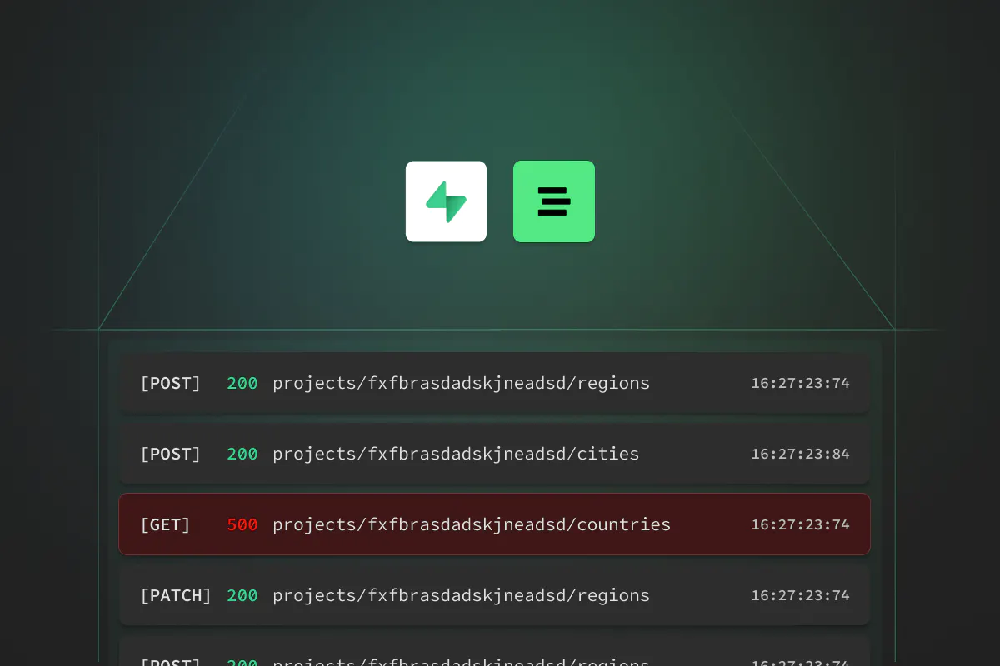

# How Supabase Uses Logflare

Logflare was [acquired by Supabase](https://supabase.com/blog/supabase-acquires-logflare?utm_source=logflare-site&utm_medium=referral&utm_campaign=logflare-acquired) back in 2021, and has since been ingested billions of log events for Supabase project stacks.

Logflare is an integrated part of the Supabase stack, powering logging for each part of the stack. Logflare's ingestion capabilities ensures that log events flow quickly into BigQuery. Since acquistion, the Logflare team has been working on building out the [self-hosting capabilities](/self-hosting) of Logflare, ensuring that Logflare can eventually become integrated as part of the Supabase stack to power the charting and logging experience.

[Logflare Endpoints](/concepts/endpoints) allows the querying of said logging data. Specifically, [query sandboxing](/concepts/endpoints#query-sandboxing) allows Supabase users to formulate their own SQL queries across their logging data, allowing complex and custom queries beyond what Supabase can provide out of the box. These queries are executed in the [Supabase Logs Explorer](https://supabase.com/docs/guides/platform/logs#logs-explorer), part of the logging experience in the Supabase Studio. Furthermore, the fully interactive log filtering user interface within the Supabase Logs UI dynamically builds SQL and allows users to eject into editing raw SQL queries to tweak and customize it to their specific debugging requirements.

[Click here for full write up of how Logflare is the Supabase Logs server](https://supabase.com/blog/supabase-logs-self-hosted)
