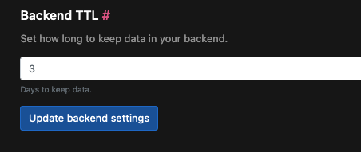

# Main Concepts

## Ingestion

There are two ways in which you can ingest data into Logflare, via specifying the source UUID, or via the source's name.

```
http://api.logflare.app/api/logs?source=9dd9a6f6-8e9b-4fa4-b682-4f2f5cd99da3

http://api.logflare.app/api/logs?source_name=my.logs.source
```

### Batching Your Events

You can ingest events individually, or via a batch.

To ingest individually (not recommended, as it is slower), send your request with the following JSON body:

```json
{
  "message": "your log event message",
  "metadata": {...}
}
```

To ingest by batch, send your request with the following JSON body:

```json
{
  "batch": [
    {"message": "your event message 1", "metadata": {...}},
    {"message": "your event message 2", "metadata": {...}},
    ...
  ]
}
```

Note that if you have mutliple sources with the same name, it will result in an error on ingestion and the log event will be discarded.

## Adaptive Schema

As your logging needs changes, Logflare is capable of detecting and adjusting the database schema accordingly. This allows you to focus on analyzing your logs instead of having to manage your logging pipeline manually.

Suppose your initial log events had the following shape:

```json
{
  "message": "This is my log event",
  "metadata": {
    "my": "first log"
  }
}
```

The generated schema would be the following:

```
message: string;
metadata: {
    my: string;
}
```

As your application requirements change, suppose you now need to add in new information to your log events.

```json
{
  "message": "This is my new log event",
  "metadata": {
    "my": "first log",
    "counter": 123
  }
}
```

Logflare will now detect the schema changes in the event, and add in the new column to the source's underlying table.

```ts
message: string;
metadata: {
  my: string;
  counter: number;
}
```

### Schema Changes

The schema changes is done automatically. If this is not the desired behaviour, you can disable this by locking the schema in the source's settings.

#### Additive Changes Only

Schema updates are additive and new columns cannot be removed through the UI. We recommend creating a new source if a new schema is desired, and migrating any existing data manually.

### Backend Time-To-Live (TTL)

Backend TTL refers to how long data is retained wtihin a given backend. Logflare will manage the retention settings for each backend where available.

:::warn
It is not advisable to manage the backend's retention settings directly without going through Logflare, as conflicts may arise.
:::

You can configure the Backend TTL via source settings under Source > Edit > Backend TTL.



Please refer to backend-specific documentation for in-depth explanation for how retention is handled.
