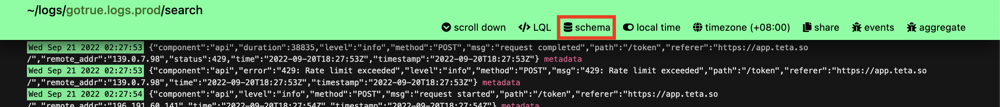
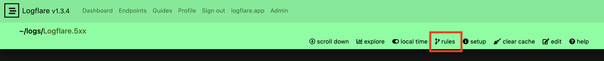
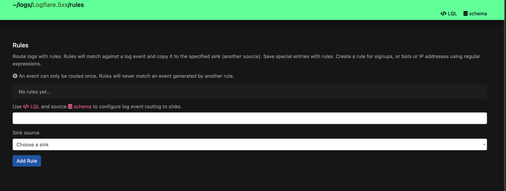

import useBaseUrl from "@docusaurus/useBaseUrl";

# Ingestion and Sources

Log events are ingested into Logflare through the **ingestion API**, where JSON payloads are sent to Logflare to be processed and inserted into the configured backend.

These processed payloads will be inserted into **Sources**. A **Source** is made of up of many log events. Log events may have one or more keys, but will always have 3 standard top-level keys:

1. `id`
2. `event_message`
3. `metadata`

The Logflare service will insert into Logflare-managed BigQuery for users on the Free and Metered plan.

## API Endpoints

There are two ways in which you can ingest data into Logflare, via specifying the source UUID, or via the source's name.

```
POST https://api.logflare.app/api/logs?source=9dd9a6f6-8e9b-4fa4-b682-4f2f5cd99da3

POST https://api.logflare.app/api/logs?source_name=my.logs.source
```

OpenAPI documentation for ingestion can be found [here](https://logflare.app/swaggerui#/Public).

### Batching Your Events

You can ingest events individually, or via a batch.

To ingest individually (not recommended, as it is slower), send your request with the following JSON body:

```json
{
  "message": "your log event message",
  "metadata": {...}
}
```

To ingest by batch, send your request with the following JSON body:

```json
{
  "batch": [
    {"message": "your event message 1", "metadata": {...}},
    {"message": "your event message 2", "metadata": {...}},
    ...
  ]
}
```

Note that if you have mutliple sources with the same name, it will result in an error on ingestion and the log event will be discarded.

## Adaptive Schema

As your logging needs changes, Logflare is capable of detecting and adjusting the database schema accordingly. This allows you to focus on analyzing your logs instead of having to manage your logging pipeline manually.

Suppose your initial log events had the following shape:

```json
{
  "message": "This is my log event",
  "metadata": {
    "my": "first log"
  }
}
```

The generated schema would be the following:

```
message: string;
metadata: {
    my: string;
}
```

As your application requirements change, suppose you now need to add in new information to your log events.

```json
{
  "message": "This is my new log event",
  "metadata": {
    "my": "first log",
    "counter": 123
  }
}
```

Logflare will now detect the schema changes in the event, and add in the new column to the source's underlying table.

```ts
message: string;
metadata: {
  my: string;
  counter: number;
}
```

### Key Transformation

When logging object, your object keys will be transformed automatically to comply with the respective backend in use. For example, BigQuery column requirements require that names only contain letters (a-z, A-Z), numbers (0-9), or underscores (\_), and it must start with a letter or underscore. This will be automatically handled for you when ingesting data.

### Schema Changes

The schema changes is done automatically. If this is not the desired behaviour, you can disable this by locking the schema in the source's settings.

#### Additive Changes Only

Schema updates are additive and new columns cannot be removed through the UI. We recommend creating a new source if a new schema is desired, and migrating any existing data manually.

### Backend Time-To-Live (TTL)

Backend TTL refers to how long data is retained wtihin a given backend. Logflare will manage the retention settings for each backend where available.

:::warning Use Logflare for Retention Handling Only
It is not advisable to manage the backend's retention settings directly without going through Logflare, as conflicts may arise.
:::

You can configure the Backend TTL via source settings under Source > Edit > Backend TTL.


Please refer to backend-specific documentation for in-depth explanation for how retention is handled.

## Querying

Logflare provides a filtering UI to expressively query for log events. Currently, the [Logflare Query Language](/concepts/lql) is supported.


Most of the time, you would be making queries to sources for certain keywords inside
of the event message. In most cases, one can rely on using simple text search by
entering the text directly into the search bar without any special syntax.

To search for specific phrases, we can wrap the query with double quotes, like this `"my text"`.

All keyword searches are case sensitive.

### Source Schemas

To quickly view all available source fields that can be filtered on, the source's schema reference is provided within the search UI. It can be accessed via the **schema** source navigation button.



### Live Search

When searching logs, you can turn your current search into a **Live Search**, which tails the source and streams new events that match the filter into the search results.

3## Query Saving

Queries that are frequently used can be saved, and will be available for quick access from the dashboard.

### Suggested Search Keys

To encourage usage of a particular search key filter, configure the **Suggested Search Keys** setting to trigger a check on each search query made through the UI.

This is particularly useful when there are custom partitions set up for certain columns in the underlying backend table.

For example, if there is an existing optimization made for the string column called `level`, we include it into the suggested search keys. Users will then be prompted to include the `level` filter in their LQL search queries, and will be given the option to force the query as well.

### Querying Outside of Logflare

Certain backends provide querying functionality. Documentation on each can be found in specific backend guide.

- [Querying in BigQuery](/backends/bigquery#querying)

## Rules

Source rules specify additional event routing conditions when incoming log events are received. Log events sent to a source that meet the conditions of a rule will also be sent to the source specified by the rule.

Source rules can be accessed by navigating to the source page and clicking on the **rules** navigation item.



Source rules accept an [LQL expression](/concepts/lql) as well as a target **sink source** to route events to.



Events can only be copied once, in order to prevent infinite copying and redundancies.

:::info Regex Rules Deprecation Notice
Regex rules are officially deprecated and will be removed in future versions. All new rules created should only be in LQL.

Regex conditions can be achieved with [LQL through the `~` operator.](/concepts/lql#metadata-filtering)
:::
