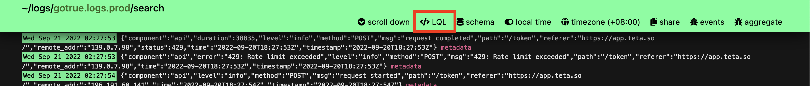

# Logflare Query Language (LQL)

The Logflare Query Language (LQL) is used within Logflare to power filtering capabilities for historical search and realtime streams.

The quick reference for LQL can be accessed within the dashboard through the **LQL** button at the source navigation bar.

#### Event Message Filtering

Any string not matching a supported operator will search against the log event message. Some strings may need to be wrapped in double quotes. By default, all LQL statements are case sensitive.

| Field   | Filter                         | Syntax                          | Example                                           |
| ------- | ------------------------------ | ------------------------------- | ------------------------------------------------- |
| Message | match exact string             | word                            | `error`                                           |
| Message | match exact string with spaces | double quoted string            | `"staging error"`                                 |
| Message | match, regex                   | regex string                    | `~server\_\d`                                     |
| Message | match regex with spaces        | double quoted regex string      | `~"log message \d\d"`                             |
| Message | match regex, case insensitive  | regex string with `(?i)` prefix | `~(?i)server\_\d`   `~"(?i)log message \d\d"` |
| Message | match regex with double quotes | regex string with symbol        | `~some\"value`   `~"msg with \" spaces"`      |
| Message | match regex, with OR           | regex string with symbol        | <code>~"jpg$&#124;jpeg$&#124;png$"</code>         |

#### Metadata Filtering

You can use data in metadata fields to limit your search. Reference your schema for supported fields.

| Field    | Filter                                  | Syntax                                                                      | Example                                                                                                           |
| -------- | --------------------------------------- | --------------------------------------------------------------------------- | ----------------------------------------------------------------------------------------------------------------- |
| Metadata | exact match                             | `path:value`                                                                | `m.response.status_code:500`                                                                                      |
| Metadata | match float, integer or datetime values | `path:>=value`   `path:>value`   `path:<=value`   `path:<value` | `m.response.status_code:>300`   `m.response.status_code:<=400`   `m.user.created_at:>2019-07-01T00:15:00` |
| Metadata | match regex                             | `path:~regex`                                                               | `m.browser:~"Firefox 5\d"`                                                                                        |
| Metadata | match regex or                          | <code>path:~"value1&#124;value2&#124;value3"</code>                         | <code>m.url:~"jpg$&#124;jpeg$&#124;png$"</code>                                                                   |
| Metadata | match array includes                    | `path:@>value`                                                              | `m.user.roles:@>"new subscriber"`                                                                                 |
| Metadata | match does NOT include                  | `-path:value`                                                               | `-m.user.company:"My Company"`                                                                                    |
| Metadata | match boolean                           | `path:true`   `path:false`                                              | `m.door_open:true`                                                                                                |
| Metadata | match NULL                              | `path:NULL`                                                                 | `m.user.plan:NULL`                                                                                                |

#### Timestamp Filtering

Timestamps are not available when live search is active.

Timestamps will be automatically converted to UTC if Logflare is set to display local time.

| Field     | Filter                         | Example                                                         |
| --------- | ------------------------------ | --------------------------------------------------------------- |
| Timestamp | today, yesterday               | `t:today`   `t:yesterday`                                   |
| Timestamp | last X time periods            | `t:last@100hours`   `t:last@7days`   `t:last@30minutes` |
| Timestamp | this calendar time period      | `t:this@week`   `t:this@day`   `t:this@month`           |
| Timestamp | date range                     | `t:2022-04-{07..09}`                                            |
| Timestamp | datetime range                 | `t:2022-04-{07..09}T00:{00..40}:00`                             |
| Timestamp | datetime range with subseconds | `t:2022-04-{07..09}T00:{00..40}:00.{001..314}`                  |

#### Chart Aggregations

Chart aggregations rules will display the aggregated trends in the chart. Chart rules use the special prefix `c`

| Field | Aggregation | Example            |
| ----- | ----------- | ------------------ |
| c     | `count`     | `c:count(*)`       |
| c     | `avg`       | `c:avg(m.latency)` |
| c     | `sum`       | `c:sum(m.latency)` |
| c     | `max`       | `c:max(m.latency)` |
| c     | `p50`       | `c:p50(m.latency)` |
| c     | `p95`       | `c:p95(m.latency)` |
| c     | `p99`       | `c:p99(m.latency)` |

## Beyond LQL

Should you need to more powerful operators and aggregation capabilities, you can drop down to your backend querying engine.

- [Querying in BigQuery](/backends/bigquery#querying-in-bigquery)
