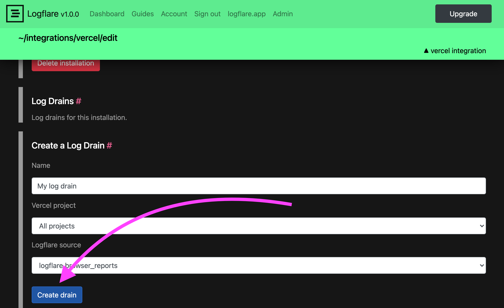
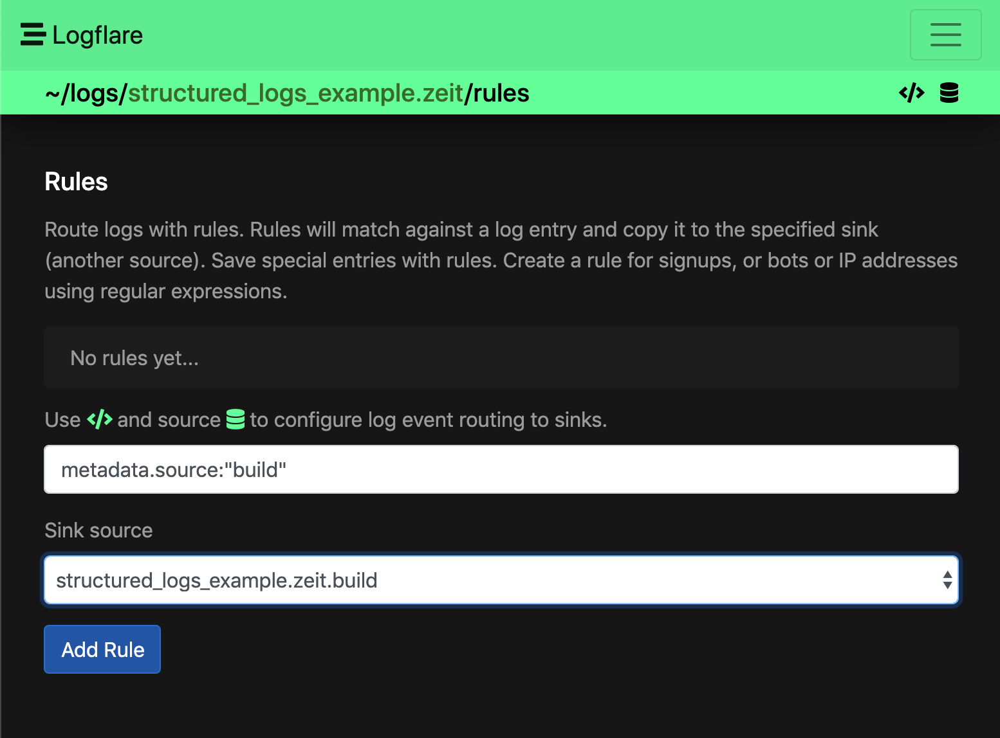
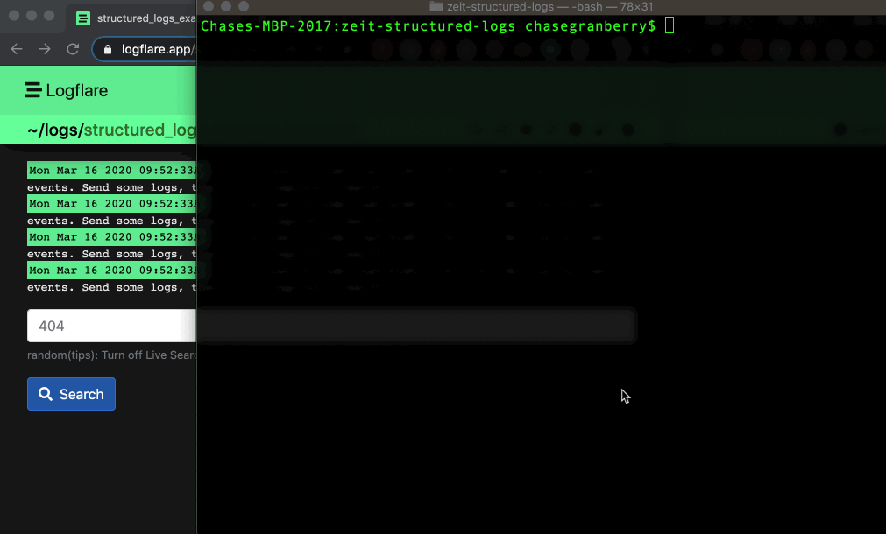
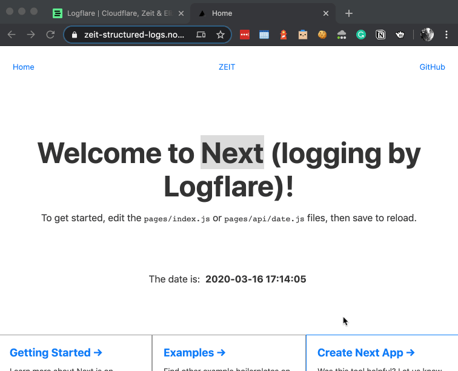
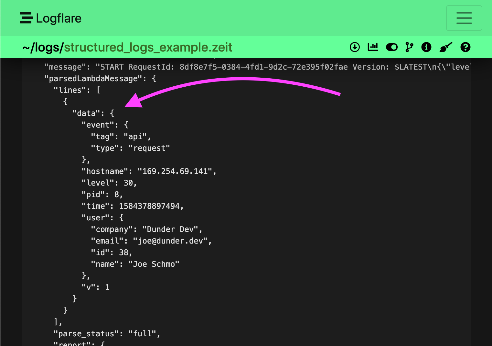
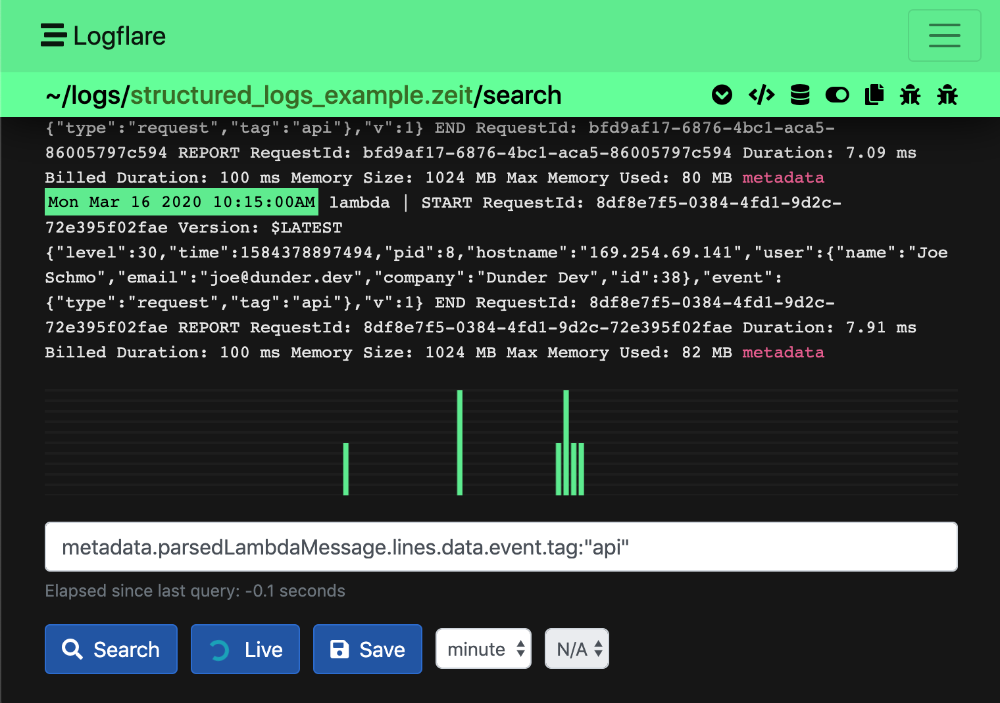
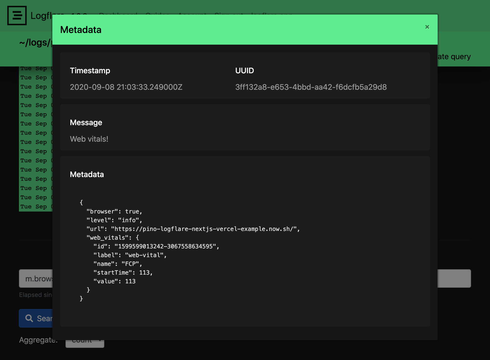

# Structured Logging with Vercel

Vercel's log drains provide a robust and scalable way to send application logs from your Vercel app to any consolidated logging system. We've developed the Logflare Vercel integration on top of log drains to make it easy for you to get logs from Vercel into your Logflare account. Once setup it's super easy to stream, search, alert on and dashboard your structured logs from Vercel.

Not only that, but you can log a structured event from your Vercel app as a stringified JSON object and we'll automatically parse that into a JSON object on our end which enables all the powerful streaming, searching, alerting and dashboaring features for each individual field of that object.

## Install the Integration

Visit the Logflare integration page and click `add`. This will walk you through the Logflare sign up process. You will create a Logflare source during that process. A `source` is where your Vercel logs will go.

[Click here install the Logflare Vercel integration.](https://vercel.co/integrations/logflare)

## Setup a Log Drain

After installing the integation, navigate to the installed integration configuration page in your Vercel account. Now you need to add a log drain. This is what tells Vercel to send all your logs to Logflare.



You can choose to filter the logs sent to Logflare by project. We recommend separating each vercel project be a different `source` in your Logflare account. Alternatively, you may send all projects to a single source, and then use Logflare's source routing to route logs to different sources. This would be useful if you don't want to setup a new log drain for each new project.

Once you've successfully added your log drain you should be able to immediately see logs start streaming into your Logflare account. Try visiting your Vercel deployment url then check your Logflare dashboard!

[Click here to visit the Logflare dashboard](https://logflare.app/dashboard)

## Logs: Build vs Static vs Lambda

Vercel gives us three main kinds of logs: **build**, **static** and **lambda**.

You will likely want to route copies of all your build logs to a different source.

To set this up add a build source and create a rule on your main Vercel source to send logs to this new build source.





Vercel also gives us some `static` and `lambda` logs depending on if the event came from their CDN or their serverless infrastructure. You can setup different rules for these as well but you probably will want these in the same source so you can have them on the same dashboard later.

## Example Searches

Here are some searches you might find useful with your Vercel deployment. It doesn't take long for your events to be searchable by Logflare.

The example below shows a search for `m.source:"static"`, which lets you see all the logs generated from the Vercel CDN.



To search for all `5xx` status codes:

```
m.proxy.statusCode:>499
```

To search for all user agents with the text `bot` in the user agent:

```
m.proxy.userAgent:~"bot"
```

When Vercel sends lambda logs over we parse data out of that message over for you automatically into the `m.parsedLambdaMessage` object.

To view all lambda requests with a response time greater than 1,000 ms:

```
m.parsedLambdaMessage.report.duration_ms:>1000
```

## Logging a Custom JSON Object

To enable even more insights from your Vercel deployment you can log any JSON object and we'll parse that accordingly.

:::warning Logflare Pino Transport
For logging large amounts of structured data, it is advised to use the [Logflare Pino Transport](https://github.com/Logflare/pino-logflare), as Vercel's logging infrastructure will truncate long log lines.
:::

### Number Handling for JavaScript

Ensure that data types match when logging from JavaScript, as each ingested event will be checked against the schema types.

We recommend forcing all numbers to be logged as either integers or floats according to the registered column's type in the schema, as JavaScript does not make a distinction between the two and may result in rejected log events.

### Example: Using Pino to Log an Object

In a Next.js project, you can use Pino to log an object.

```js
const logger = require("pino")();
logger.info({
  user: {
    name: "Joe Schmo",
    email: "joe@dunder.dev",
    company: "Dunder Dev",
    id: 38,
  },
  event: { type: "request", tag: "api" },
});
```

This will then be saved in Logflare as so:


You can then perform a search on the logged data using LQL:

```
m.parsedLambdaMessage.lines.data.event.tag:api
```



## Isomorphic Logging with Vercel, Pino, and Logflare

Using [`pino-logflare`](https://github.com/Logflare/pino-logflare) you can automatically log from the browser and the server using the same logger interface.

When using [`pino-logflare`](https://github.com/Logflare/pino-logflare) with Vercel, be sure to instantiate your logger with the config described in the `pino-logflare` repo.

### Example Configuration

In this example, we will set up your server side logs to be logged to `stdout`. Vercel then picks up and forwards these logs to Logflare via the Vercel Logflare integration. The browser client will then send logs directly to Logflare via an HTTP request.

[Click here to view a Vercel pino-logflare config example](https://github.com/Logflare/pino-logflare/blob/master/docs/VERCEL.md)



## Production vs Preview vs Development

When logging a custom JSON object with Pino you should separate your production logs from everything else. Environment variables make this easy.

Use [Vercel's environment variables](https://vercel.com/docs/v2/build-step#environment-variables) and setup an `ENV` variable for `production`, `preview` and `development`.

Then setup Pino to always log the environment. When instantiating, the fields in the `base` object are always included with your log events.

```js
const logger = require("pino")({
  base: {
    env: process.env.ENV || "ENV not set",
  },
});
```
